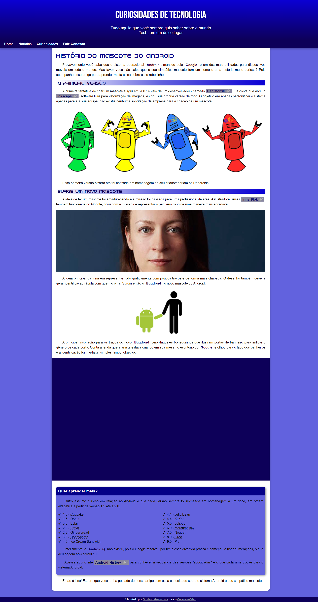

# Projeto Android - Curso em Vídeo

Projeto construído durante o curso de HTML5 e CSS3 do Curso em Vídeo.

[Clique aqui para acessar](https://iagovalverde.github.io/myproject-android/)

# Tecnologias

- HTML
- CSS
- Git e Github

# Aprendizagem

- Nesse projeto aprendi a criar um site com imagens e vídeos responsivos.
- Uso de paleta monocromática.
- Criação de links externos.
- Uso de vídeos externos ao servidor. 
- E muitas outras coisas.

## Contato

iagopachiani96@gmail.com